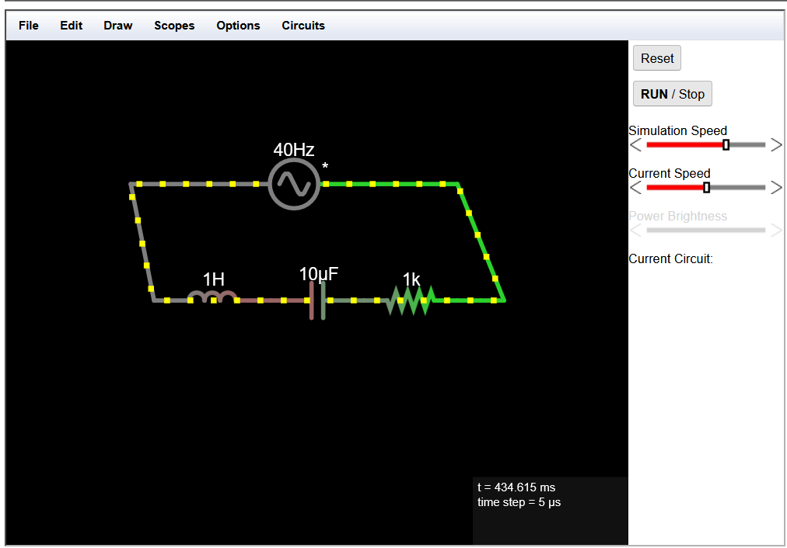

#  Basic RLC Circuit Simulation – Falstad

This repository showcases a simple **RLC circuit** (Resistor–Inductor–Capacitor) created using the [Falstad Circuit Simulator](https://www.falstad.com/circuit/). It demonstrates key electrical concepts like **resonance**, **damping**, and **time constants** through an interactive simulation.

---

## 🧰 Components Used

| Symbol | Component       | Description                           |
|--------|------------------|---------------------------------------|
| ⚡     | Voltage Source    | AC power supply (40 Hz)               |
| 🌀     | Inductor (L)      | 1 H – stores energy in magnetic field |
| ⚫     | Capacitor (C)     | 10 µF – stores energy in electric field |
| 🟤     | Resistor (R)      | 1 kΩ – limits current and adds damping |
| ⏚     | Ground            | Reference node                        |

---

## 🧪 Circuit Simulation Overview

This circuit simulates an RLC loop responding to an AC source. The behavior includes:

- 🔁 **Oscillation** due to L and C
- ⏱️ **Time constant** from R and C
- ⚡ **Current flow** visualization using Falstad's yellow dot animation

---

## ▶️ How to Run the Simulation

1. Open the simulator at 👉 [https://www.falstad.com/circuit](https://www.falstad.com/circuit)
2. Click **File > Import From Text...**
3. Copy the contents of `circuit.txt` from this repo
4. Click **OK** to load and simulate the circuit

---

## 🛠️ Customization Ideas

You can modify or extend the simulation by:

- 🔘 Adding a **switch** to create an RC charging/discharging demo
- ➕ Inserting a **diode** for rectifier behavior
- 🔄 Switching to **DC** to explore transient effects
- 🧠 Building **logic circuits** using Falstad’s digital components

---

## 📂 Files Included

- `circuit.txt` – Falstad circuit file (RLC configuration)
- `README.md` – Project documentation
- *(Optional)* `circuit.png` – Circuit diagram screenshot

---

## 📚 References

- 🔗 [Falstad Circuit Simulator](https://www.falstad.com/circuit)
- 📘 [RLC Circuit – Wikipedia](https://en.wikipedia.org/wiki/RLC_circuit)

---

## 📸 Preview

---

> Created for learning and experimentation. Feel free to fork and modify!
